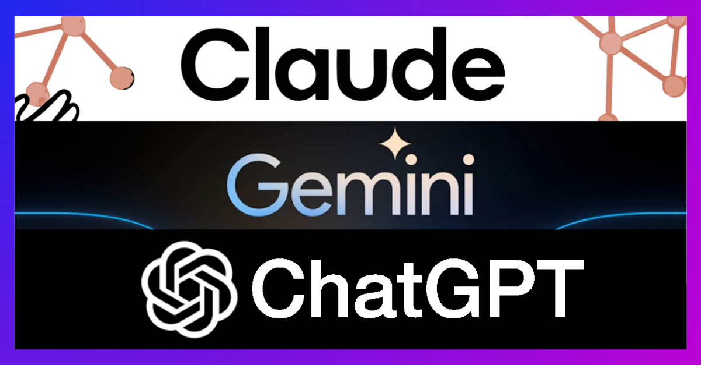

<style>
    .img {
        max-width: 80%;
        height: auto;
        display: block;
        margin: 0 auto;
        border-radius: 8px;
        box-shadow: 0px 10px 20px rgba(0, 0, 0, 0.3);
    }
</style>


<br>

### Introduction

Artificial Intelligence (AI) has revolutionized education, particularly in Software Engineering, where it aids in learning, problem-solving, and development. In ICS 314, I utilized tools like ChatGPT and GitHub Copilot to supplement my understanding of fundamental technologies, including Next.js, TypeScript, Prisma ORM, PostgreSQL, and Vercel. These tools offered immediate feedback and assistance in times were physical help was unavailable, helping me solve these problems efficiently.

### Personal Experience with AI

**Experience WODs**  
For the Experience WODs, I did not use AI since I was already familiar with most concepts covered.

**In-class Practice WODs & In-class WODs:**  
During practice WODs and in-class WODs, I only used AI for more trivial things such as CSS styling or remembering a Bootstrap component name.

**Essays:**  
For a few of the essays, I used ChatGPT to brainstorm and outline ideas given my own. In the past, my writings sometimes felt disorganized. Although I have fixed this issue, AI prompting helps me assert the structure of how I want my essay to be.

**Final project:**  
 In our final project, which involved building a web application with Next.js, Prisma ORM, and PostgreSQL, I used ChatGPT to help with API routes and server-side components. For example, I have had to ask: "What is the difference between server components and API routes, and why are API routes needed?" AI often gives good explanations for most questions, and in this case I was able to understand clearly.

 In addition, AI was directly used as a part of our project's solution: to translate and describe menu items in foreign languages. By using the OpenAI API, I could do prompt engineering to get an accurate translation back, even in a properly structured JSON format.

**Learning a concept/tutorial:**  
 When learning TypeScript's strict typing, I asked ChatGPT, "Why is strict typing necessary in JavaScript?" Since I have used JavaScript a lot in past smaller projects, I didn't work much with complicated objects or data, but AI helped me understand that Typescript can catch type-related errors at compile time instead of at runtime to avoid and track bugs.

**Answering a question in class or in Discord:**  
When answering questions in class or Discord, I did not use AI, as answering a question I don't fully understand myself would not be of much help, especially if follow-up questions were asked.

**Asking or answering a smart question:**  
I preferred asking smart questions directly to peers or instructors to foster collaboration and avoid relying solely on AI for problem-solving.

**Coding example**  
Although I have found some success in Copilot, it failed to figure out some debugging issues. For example, I kept getting a client-side runtime error that 

```favArr.includes is not a function.``` 

After asking AI why this was the case and providing my codebase for reference, it gave a very shallow answer that :

```
The error indicates that favArr is not an array, as the includes method is only available on arrays.
Let's first check the type of favArr and ensure it is an array. If it is not, we need to convert it to an array or initialize it properly.

Here's a step-by-step plan to fix the issue:

- Verify the initialization of favArr.
- Ensure favArr is an array.
- If favArr is not an array, convert or initialize it as an array.
```

Despite the validity of the steps, my array was already initialized through my component's props (default value = []). I ended up finding a bug in my API routing that seemed to cause the error.

**Explaining code:**  
I did not use AI to explain much code, as I took it upon myself to understand it by tracing the data and algorithms.

**Writing code:**  
AI such as Copilot assisted in tab-completing repetetive coding tasks or easily-predictable tasks.

**Documenting code:**  
For documentation, I used ChatGPT to draft JSDoc comments. For example, I asked, “Write a JSDoc comment for a function that fetches user data from a PostgreSQL database,” and tailored the output to our project's needs.

**Quality assurance (ESLint Errors):**  
When encountering ESLint errors, instead of using AI, I used VSCode's "auto-fix all auto-fixable issues" feature through a TypeScript intellisense extensions package.

**Other uses in ICS 314 not listed:**  
I did not use much AI in ways that were not already listed.

### Impact on Learning and Understanding

Using AI tools in ICS 314 enhanced my learning by providing quick feedback and a different perspective on things. These tools accelerated my workflow and exposed me to industry best practices. However, I made a conscious effort to research and validate AI-generated solutions, ensuring I understood the underlying concepts. This approach prevented over-reliance and deepened my comprehension of software engineering principles.

### Practical Applications

 Outside ICS 314, I used AI to debug and optimize features in other projects, such as my TubeReader project. For example, ChatGPT helped refine PHP PDO queries and uncommon React Hooks, streamlining both the front and back-end. These experiences demonstrated AI's potential in tackling real-world challenges.

### Challenges and Opportunities

Challenges included occasional inaccuracies in AI-generated suggestions and the temptation to rely on it excessively. To mitigate this, I adopted a research-first approach, always ensuring I fully understood each suggestion before implementation. AI services such as ChatGPT or GitHub Copilot (uses GPT-4o) were often reliable, while Google Gemini and Anthropic's Claude were sometimes shaky and unreliable.

### Comparative Analysis

Traditional teaching methods emphasize foundational knowledge and critical thinking, while AI tools offer immediate assistance and diverse solutions. It is efficient to use both in a reasonable balance to aid in understanding even in times where professors or TAs are not there.

### Future Considerations

AI in software engineering is inevitable, but I don't think it will be able to fully take over the field. I believe there will always need a driver and prompt engineer to get the right code and answers needed.

### Conclusion

My experience with AI in ICS 314 highlighted its value as a supplementary tool rather than a crutch. By using AI responsibly and conducting my own online research, I was able to enhance my learning and problem-solving abilities. For future courses, I recommend clear guidelines on AI usage to ensure students like myself develop both technical expertise and independent thinking skills.


