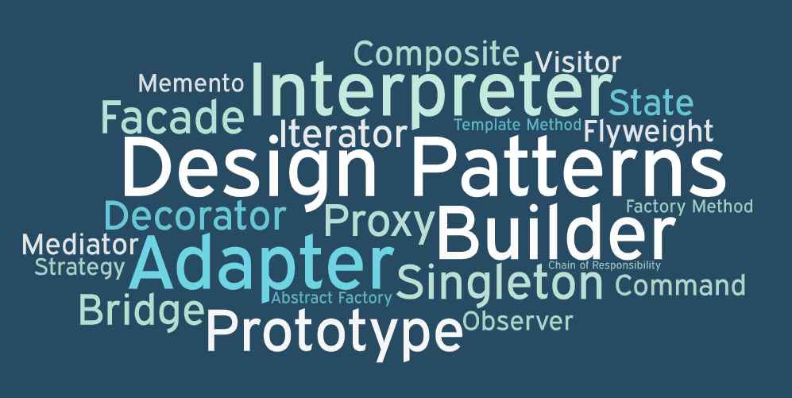

 

Imagine navigating an unknown location, surrounded by a number of streets and landmarks. You know your destination, but without a map or directions, you're left guessing the best route. Maybe you will make progression, or maybe you will end back up where you started, wasting precious time. Now imagine you had a map, better yet, one created by localresidents who have already charted the most efficient and reliable paths.

In software development, design patterns are those roadmaps. They are proven solutions to common everyday coding problems, made by seasoned developers who have already navigated the challenge head on. Design patterns don't aren't direct instructions, but they provide a clear idea of how to reach your destination in a smarter, more structured way.

## Why a Roadmap?
In software, projects require completing many different tasks: some new ones, and some old ones. Early in my development journey, I'd often tackle problems head-on, writing messy code with insufficient documentation. Over time, some problems I had faced became repetitive, such as implementing CRUD systems, coordinating objects, or structuring my React application. There had to be a better way

That's where design patterns come in. They offered me templates for organizing my code, making it easier to understand and maintain.

For example, the Singleton pattern, which ensures only one instance of a class exists while providing a global access. It is the "town hall" or on a larger scale the White House so-to-speak of the application: no matter how many departments or people interact with it, there exists only one central authority. In the past, I have unknowningly used Singleton to manage database connections in my projects, ensuring that resources aren't wasted on duplicate instances. It's a simple pattern, but it brings order to situations that could easily spiral into chaos.

## Structuring the City
Another design pattern that changed how I think about software is Model-View-Controller (MVC). If your application is a city, MVC is like zoning laws that divides jobs into organized departments:

- The Model handles the data, like the city's records and resources.
- The View presents the data to users, much like city maps or guides.
- The Controller is like the planner, directing traffic between the Model and View.
I have used MVC a little bit in web development projects, but after learning more about it, I want to use it more often going forward. 

## To Conclude
Design patterns aren't recipes that make software perfect, and they are not rigid rules to follow at every turn. They are maps that help guide you through familiar terrain so you can save your time and effort for more dificult tasks. So next time you find yourself creating a new project not knowing how or where to start, reach for the roadmap. It won't solve everything, but it will be a good navigational aid for many situations.

