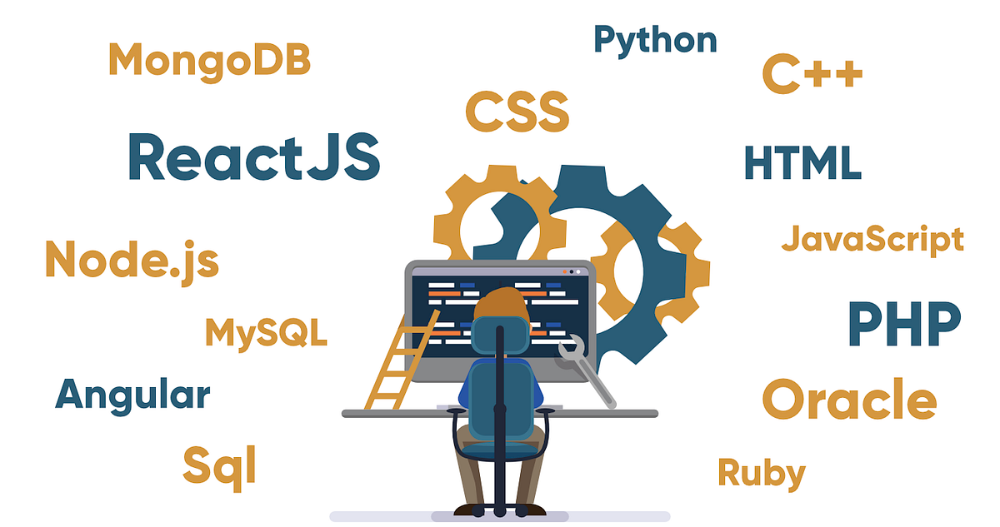

<style>
    .img {
        max-width: 60%;
        height: auto;
        display: block;
        margin: 0 auto;
        border-radius: 8px;
        box-shadow: 0px 10px 20px rgba(0, 0, 0, 0.3);
    }
</style>


<br>

## My Experience with Software Engineering

Throughout the years, software development has captivated me by the truly infinite possibilities for different program ideas. I enjoy solving problems in innovative ways (that might not always be efficient).

My interests currently lie in full-stack web development, where I like creating both appealing and useful software with React and its many libraries. However, as of late, I have been interested more in back-end development and learning more about web servers. I have been working with lots of data and APIs, which has been a hassle at times, but regardless, it is still vital to any full-stack application.

### Back-End Work is Tough Sometimes 😥

```php
$calc = ((isset($_GET['index']) ? (int)$_GET['index'] : 0) * $numPerPage); // Offset calculation
$sqlQuery = "SELECT * FROM `articles` WHERE user_id = :userId $sqlAdd $sqlSortBy LIMIT :numPerPage OFFSET :calc";

// Bind parameters
$stmt->bindParam(':userId', $userId, PDO::PARAM_INT);
$stmt->bindParam(':category', $category, PDO::PARAM_STR);
$stmt->bindParam(':language', $language, PDO::PARAM_STR);
$stmt->bindParam(':articleTitle', $articleTitle, PDO::PARAM_STR);
$stmt->bindParam(':channel', $channel, PDO::PARAM_STR);
$stmt->bindParam(':numPerPage', $numPerPage, PDO::PARAM_INT);
$stmt->bindParam(':calc', $calc, PDO::PARAM_INT);

// Execute the query
$stmt->execute();

```

## What Next?

In the near future, I look forward to deepening my knowledge on TypeScript so that I can use it in my usual tech stack. Additionally, I would like to learn about Next.js and both its page routing and SSR (server-side rendering) to use in my future React applications. 

Recognizing the critical role of SEO, I understand how slow client-side rendering can strongly harm Google search results. Learning to leverage SSR with Next.js will be a major step towards optimizing the performance and searchability of my applications for more click-throughs.


On the back-end side of things, I want to explore PostgreSQL and what it has to offer as a database. I am familiar with MySQL and MySQL Workbench and have used it in the past because of its free price tag, so I am eager to see why some consider PostgreSQL a more premium option.

Understanding its unique features will help expand my knowledge of database management. Thankfully PostgreSQL, like MySQL, is a SQL database, as I simply cannot imagine using a SQL-less query language. 


## Wrap Up

In short, my software engineering journey is driven by a passion for creating meaningful programs that provide a pleasant user experience. 

I am committed to expanding my knowledge of new languages, frameworks, and back-end technologies to enhance my full-stack capabilities. With the ever changing world of technology, I hope to keep up with the latest and greatest technologies.
