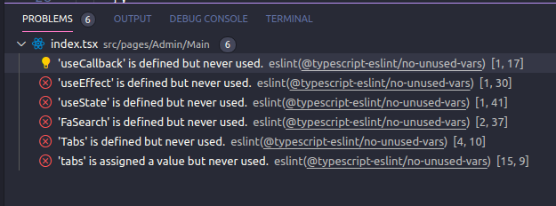

 

## Importance of Coding Standards

Coding standards are often strict guidelines that help maintain consistency, readability, and quality in code. Standards such as ESLint (used for JavaScript and TypeScript) cover important aspects like naming conventions, code organization, indentation, commenting, and error handling, ensuring that code remains easy to read and maintain.

While I understand the importance of following these standards, they can sometimes feel tedious and annoying at times. However, I’ve found that holding to them ultimately makes working on projects, especially collaborative ones, much smoother in the long run.

## The Easy Rules to Follow

One area I am most comfortable with is proper naming conventions and code organization. Clear and meaningful variable or function names help make the code self-explanatory, which ultimately reduces the need for excessive comments.

Organizing code into logical chunks makes it easier to debug and scale as a project grows. I am used to programming like this in my personal projects, and I believe they contribute significantly to the readability and navigability of a codebase.

## Fustration with Standards

On the other hand, specific coding standards feel more cumbersome. For instance, I prefer using a four-space indentation over two spaces, but it can be irritating when going in between projects that enforce different indentation rules.

I’m relatively diligent about writing function header comments, as they help summarize a function’s purpose quickly. However, more specific line-by-line comments are exhausting and often feel unnecessary when the code is well-named and structured.

Finally, error handling can be particularly painful, especially when dealing with complex API responses or backend code. Handling so many potential HTTP codes with many case switch statements requires a level of foresight and attention to detail that can sometimes slow down development. However, I recognize that it is crucial to building robust applications.