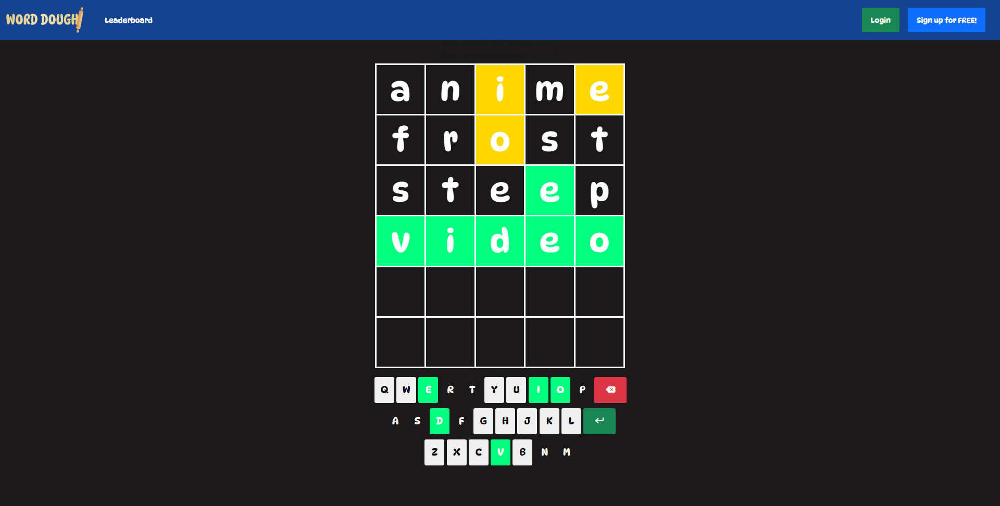

Word Dough is a revemaped competitive version of New York Times' viral game, "Wordle" with an added login, registration, and leaderboard system.

It uses the Merriam-Webster Dictionary API to verify the validity of the user-inputted word and OpenAI's Moderation API to keep player's usernames appropriate.

Sets and reads client-side cookies for proper account authorization.

I have gained invaluable experience on backend programming with PHP using MySQLi and PDO along with MySQL.

